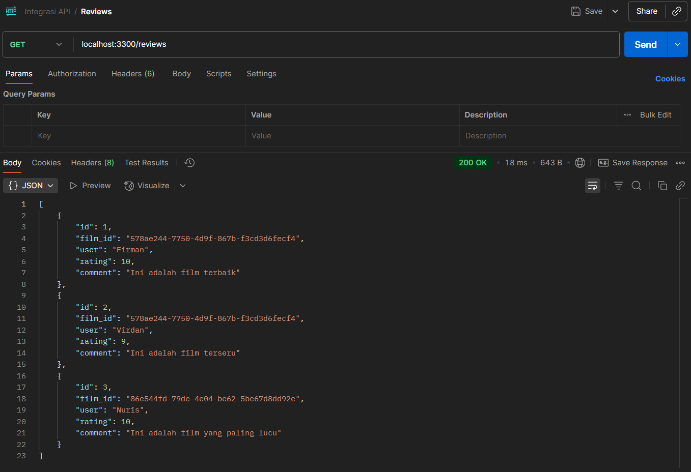

# Proyek API Ulasan Film - Kelompok 4

## Anggota Kelompok
- Firman Ardiansyah (362458302101)
- Virdan Andi Wardana (362458302039)
- Moh. Nuris Gustian Arrafi (362458302040)

## Deskripsi Proyek
API ini adalah layanan internal untuk mengelola ulasan film dari Studio Ghibli,
dengan data film yang direferensikan dari Ghibli API publik.

## Cara Menjalankan Proyek
1. Masuk ke folder proyek (Integrasi_API)
2. Clone repository ini: "git clone https://github.com/Mannztx/Interoperability-Integrasi_API.git"
3. Masuk ke direktori: "cd Interoperability-Integrasi_API"
4. Install dependensi: "npm install express cors", "npm install nodemon" agar auto update
5. Jalankan server: "node server.js" atau "nodemon server.js"
Server akan berjalan di "http://localhost:3300".

## Daftar Endpoint
- "GET /status": Cek status API.

- "GET reviews": Mengambil semua ulasan.

- "GET /reviews/:id": Mengambil ulasan spesifik.

- "POST reviews": Membuat ulasan baru.

- "PUT /reviews/:id": Memperbarui ulasan.

- "DELETE /reviews:id": Menghapus ulasan.

- "GET /reviews" after POST, PUT, dan DELETE

## Tabel Checklist Pengujian

